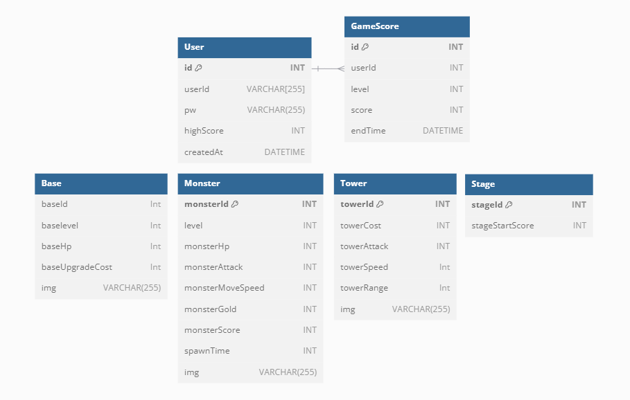

# 우리 기지에는 못 박는다

## 우못박 프로젝트

### 개요

---

웹 소켓을 이용해 타워 디펜스 게임 "우리 기지에는 못 박는다"를 만들었다.

서버와 클라이언트가 데이터를 주고 받고, 유저의 선택에 따른 여러가지 검증을 통해 버그성 플레이를 방지하고 서버가 다운되지 않도록 다양한 에러처리를 통해 서버의 상태를 유지시킨다.

### 기술 스택

---

- Node.js
- Express.js
- MySQL

## 프로젝트 실행

1. 의존성 설치

```
yarn install
```

2. CSV 파일 DB에 연동

```
yarn run DB
```

3. 실행

```
// 서버
yarn run dev

// 클라이언트
npx http-server tower_defense_-_client
```

## ERD 다이어그램



## 조작법

```
Z : 타워 구매 , X : 타워 판매 , C : 기지 강화 , SpaceBar : 일시정지
```

## 목적

---

시간마다 등장하는 몬스터와 보스 황금고블린을 처치하여 돈을 모으고 타워를 구매하여 최대한 오래 살아남는걸 목적으로 하는 게임입니다.

## 구현기능

1. 타워 구매

   유저는 현재 보유한 골드에 따라 현재 상황에 맞는 타워를 구매할 수 있습니다.
   타워 구매시 현재 유저의 기지레벨에 따른 타워를 생성합니다.
   타워는 생성된 길을따라 길 주변에 랜덤으로 생성됩니다.

2. 타워 판매 **_(도전 기능)_**

   유저는 마우스를 이용하여 특정 타워를 지정하여 판매할 수 있습니다.
   판매한 타워는 구매한 금액과 동일한 골드를 반환하고 사라집니다.

3. 기지 강화 + 타워 강화 **_(추가 + 도전 기능)_**

   유저는 일정한 골드는 소비하여 기지를 강화할 수 있습니다.
   기지를 강화하면 기지의 최대체력이 증가하고 이전까지 소비한 모든체력을 회복합니다.
   기지를 강화하면 현재 구매가능한 타워의 레벨, 능력치가 변동되며, 구매비용 또한 증가합니다.
   기지를 강화할때마다 외형이 변하며 구매가능한 타워의 외형또한 변경됩니다.

4. 일시정지 **_(추가 기능)_**

   유저는 스페이스바 혹은 버튼을 사용하여 게임을 일시정지 시킬수 있습니다.
   모든 상황이 멈추며 스페이스바 혹은 버튼을 한번더 클릭한다면 일시정지를 해제할 수 있습니디.

5. 다음 스테이지

   유저가 특정 스코어를 달성하면 다음 스테이지로 넘어갑니다.
   스테이지가 넘어갈수록 강한 몬스터가 나오며 더 많은 골드를 획득할 수 있습니다.

6. 보스 몬스터 **_(추가 기능)_**

   특정 스코어를 달성할때마다 보스 몬스터가 출현합니다.
   보스 몬스터는 일반 몬스터보다 속도가 느리지만 훨씬 많은 체력과 공격력을 가지고 있으며 일반 몬스터의 2배에 해당하는 사이즈를 가지고 있습니다.
   보스 몬스터는 한번 처치할때마다 2배씩 강해집니다. 이는 타워를 생성하는 빈도보다 보스의 스탯상승폭을 높여 게임이 무한하게 진행되는것을 막는 역할을 합니다.
   또한 보스 몬스터의 특별함을 주기위해 프레임마다 이미지가 움직이도록 구현했습니다.

7. 황금 고블린 **_(도전 기능)_**

   모든 유저의 플레이를 동일하게 할 수 있는 점수 시스템을 가지고있기에 확률에 따라 등장하는 황금 고블린 몬스터를 추가했습니다.
   해당 몬스터는 일반 OR 보스 몬스터보다 월등한 속도로 달려가며 처치한다면 일반 몬스터보다 훨씬더 많은 보상을 획득할 수 있도록 구현했습니다.
   더 많은 황금 고블린을 잡은 유저는 더욱더 많은 타워를 구매하여 조금더 유리하게 게임을 진행할 수 있습니다.
   이는 더욱 다양한 사용자 경험을 제공합니다.

8. 이벤트 텍스트 추가

   유저가 특정 이벤트를 실행시킬경우 해당 이벤트가 성공했는지 실패했는지를 구별하기 쉽도록 이벤트마다 텍스트를 출력하고 1초후 사라지도록 구현했습니다.
   가독성을 높이기위해 텍스트에 애니메이션을 주어 글자가 겹쳐보이지 않도록 구현했습니다.

9. 하이스코어

   유저가 현재까지 획득한 가장 높은 스코어가 하이스코어로 등록됩니다.
   하이스코어가 높은 3명은 랭키에 오르며 이는 메인 페이지에서 확인할 수 있습니다.

10. CSV 파일 DB에 연동 **_(추가 기능)_**

    DB 데이터를 CSV 파일로 삽입, 삭제, 수정이 이루어지고 있습니다.
