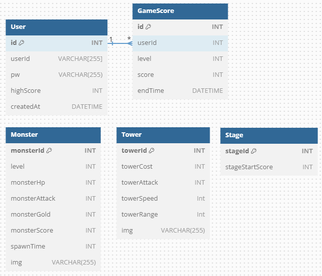

# 타워 디펜스 게임 만들기

### 개요

---

웹 소켓을 이용해 "타워 디펜스 게임"을 구현했다.

서버와 클라이언트가 데이터를 주고 받고, 레벨이 오를 때마다 여러 데이터들을 검증한다.

### 기술 스택

---

- Node.js
- Express.js

## 프로젝트 실행

1. 의존성 설치

```
yarn install
```

2. 실행

```
// 서버
yarn run dev

// 클라이언트
npx http-server tower_defense_-_client
```

## ERD 다이어그램


